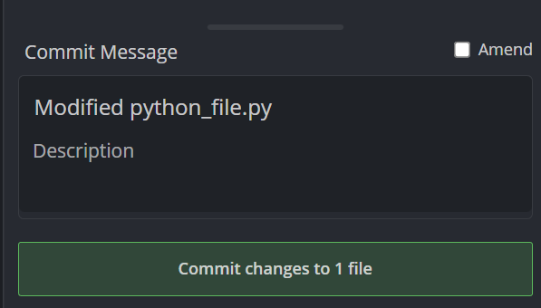
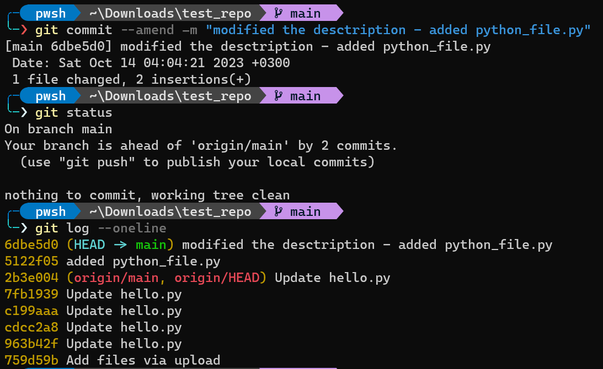
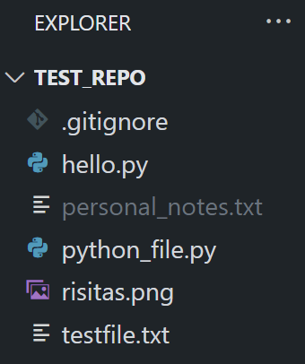
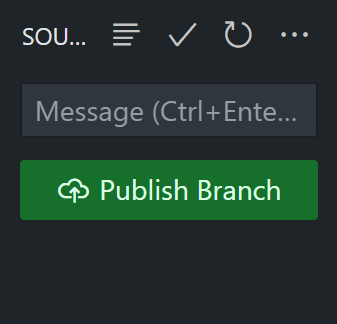
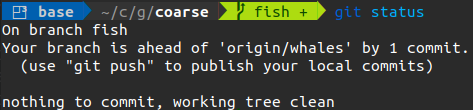

## Contact Details:
email: pansap99@gmail.com
LinkedIn: [Panagiotis Sapoutzoglou](https://www.linkedin.com/in/panagiotis-sapoutzoglou-66984a201/)

# Table of Contents

- [What is git ??](#what-is-git-)
- [Git vs Github](#git-vs-github)
- [Git installation](#git-installation)
  - [Windows installation](#windows-installation)
  - [Mac Installation](#mac-installation)
  - [Linux Installation](#linux-installation)
  - [Configuring GIT](#configuring-git)
- [Configure git to use VSCode as the default editor](#configure-git-to-use-vscode-as-the-default-editor)
- [GitKraken](#gitkraken)
  - [Installation](#installation)
  - [Linux](#linux)
- [Git repository ("repo" for short)](#git-repository-repo-for-short)
- [git status (command)](#git-status-command)
- [git init (command) Initialize a repository in a folder](#git-init-command-initialize-a-repository-in-a-folder)
  - [What actually happens when we use git init?](#what-actually-happens-when-we-use-git-init)
- [Commit](#commit)
  - [What is a commit ?](#what-is-a-commit-)
- [git add (command)](#git-add-command)
- [git commit (command)](#git-commit-command)
- [git log (command)](#git-log-command)
- [Commiting with a GUI (GitKraken)](#commiting-with-a-gui-gitkraken)
- [Modify the last commit (you forgot, something or you want to change the description)](#modify-the-last-commit-you-forgot-something-or-you-want-to-change-the-description)
- [Ignoring files](#ignoring-files)
- [Branches](#branches)
  - [Master branch](#master-branch)
  - [HEAD -\> master](#head---master)
  - [Viewing branches](#viewing-branches)
  - [Creating and switching between branches](#creating-and-switching-between-branches)
  - [git checkout (command - another way of switching)](#git-checkout-command---another-way-of-switching)
  - [Create and switch with one command](#create-and-switch-with-one-command)
  - [What happend when you switch branch when you have unstaged changes?](#what-happend-when-you-switch-branch-when-you-have-unstaged-changes)
  - [What happens when we switch branch when we have untracked files? (new files that git dont track)](#what-happens-when-we-switch-branch-when-we-have-untracked-files-new-files-that-git-dont-track)
  - [Delete branch](#delete-branch)
  - [Rename a branch](#rename-a-branch)
- [Branhes, HEAD - git behind the scenes](#branhes-head---git-behind-the-scenes)
- [Merging Branches (:grimacing:)](#merging-branches-grimacing)
- [Visualize Merges](#visualize-merges)
- [Generate Merge Commits](#generate-merge-commits)
- [Merge branches with confilicts](#merge-branches-with-confilicts)
- [Resolving Merge Conflicts](#resolving-merge-conflicts)
- [git diff (command) - Comparing changes](#git-diff-command---comparing-changes)
  - [Interprete the output of the git diff](#interprete-the-output-of-the-git-diff)
  - [View unstaged changes, changes in the working directory etc](#view-unstaged-changes-changes-in-the-working-directory-etc)
  - [View staged changes](#view-staged-changes)
  - [Compare specific Files](#compare-specific-files)
  - [Comprare changes between branches](#comprare-changes-between-branches)
  - [Compare changes between commits](#compare-changes-between-commits)
  - [Diffs with GUI](#diffs-with-gui)
- [Stashing](#stashing)
  - [Stash apply](#stash-apply)
  - [Stashing multiple items ???](#stashing-multiple-items-)
  - [How we can drop and clean the stash](#how-we-can-drop-and-clean-the-stash)
- [Undoing changes and "time-travel"](#undoing-changes-and-time-travel)
  - [Checkout old commits](#checkout-old-commits)
  - [Reataching the HEAD](#reataching-the-head)
  - [Checkout commits of the current branch relative to HEAD](#checkout-commits-of-the-current-branch-relative-to-head)
  - [Discarding changes with ```git checkout```](#discarding-changes-with-git-checkout)
  - [Undoing changes](#undoing-changes)
  - [Unstaging Changes with ```git restore```](#unstaging-changes-with-git-restore)
  - [Undoing commits with ```git reset```](#undoing-commits-with-git-reset)
  - [Undo commits with ```git revert```](#undo-commits-with-git-revert)
  - [When to use ```git reset``` and when ```git revert``` (important)](#when-to-use-git-reset-and-when-git-revert-important)
- [Github](#github)
- [Cloning Github repositories](#cloning-github-repositories)
- [Github SSH config](#github-ssh-config)
  - [From git to Github](#from-git-to-github)
  - [Walk around the github page](#walk-around-the-github-page)
  - [git push in more detail](#git-push-in-more-detail)
  - [The -u option with git push](#the--u-option-with-git-push)
- [Github fetching and pulling](#github-fetching-and-pulling)
  - [Remote branches but no local branches](#remote-branches-but-no-local-branches)
- [Git Fetch](#git-fetch)
- [Git Pull](#git-pull)
- [Public vs Private repositories](#public-vs-private-repositories)
- [Adding collaborators to a repo](#adding-collaborators-to-a-repo)
- [README.md file ??](#readmemd-file-)
- [Markdown](#markdown)
- [Collaboration workflows](#collaboration-workflows)
  - [The holly Master/Main branch](#the-holly-mastermain-branch)
  - [Feature branches](#feature-branches)
    - [Feature branch naming](#feature-branch-naming)
    - [Merging In Feature Branches](#merging-in-feature-branches)
  - [Pull requestss (PR)](#pull-requestss-pr)
  - [Configuring protection rules](#configuring-protection-rules)
  - [Fork\&Clone workflow](#forkclone-workflow)


# What is git ??

It's a version control system. It is a software that tracks and manages changes to files over time.
Updates, changes to files, make new files, work in the same project with others.
Git helps us to manage our projects. We can track changes, compare different versions of our project, go back to an older version (revert changes). Collaborate with others, share changes and combine them.

Git is like playing a videogame with a long story. So, you save chekpoints during the game and if you die you will respawn back in on of the chekcpoints. This also holds for git. You can make "checkpoints" of your projects so even if you messed all up you can still find salvation in a git checkpoint.

# Git vs Github

Git is the version control software that runs in your pc. You don't even need an acount.

Github (Git - hub) hosts Git repositories (which can be projects) in the cloud and make it possible and easier to colaborative with other people. It is a web service and you also need an account. 


# Git installation

We can interact with git using two ways:

- CLI (command line interface)
- GUI (graphical user interface)

Git was originally created as a command line interface tool. GUI exists to make the life easier for people with little-to-no command line experience.

## Windows installation

## Mac Installation

## Linux Installation

## Configuring GIT

Set our username and email.

- ```git config --global user.name "pansap99"```

Query the currnet username

- ```git config user.name```

Configure our email

- ```git config --global user.email pansap99@gmail.com```
- ```git config user.email```

When we make changes the changes will be attributed to this user name and email

# Configure git to use VSCode as the default editor

```
git config --global core.editor "code --wait"
```

# GitKraken

## Installation

## Linux

1. ```wget https://release.gitkraken.com/linux/gitkraken-amd64.deb```
2. ```sudo apt install ./gitkraken-amd64.deb```
3. ```gitkraken```

# Git repository ("repo" for short)

In order to use git we need to be in a git repository (create a folder and navigate inside). Every git repo is independent from each other.

# git status (command)

**```git status```** gives information on the **current status** of a git repository and its contents

If you run ```git status``` inside a folder that is not a git repository it will yield :

```fatal: not a git repository```

# git init (command) Initialize a repository in a folder

We can first create a directory where we want to create the repo like:

```mkdir MyProject && cd MyProject```

Run ```git init``` inside this folder and this will make the current folder a git repository and the ```git status``` command will yield info about the repository.

!comment add image

The init command runs one time when we create the repo of the project.

## What actually happens when we use git init?

Creates a directory named **.git** which as you may know it's a hidden folder (all hidden folders start with "."). If you delete this folder, the folder is not a git repo anymore. There is a reason that is hidden, so you don't mess around with it and lose your work by deleting it (thus deleting git history etc.)

WARNING! We dont want to run ```git init``` inside an already existing repo or ANY of its subfolders.

# Commit

## What is a commit ?

A commit is like a "checkpoint" in a git repository. A snapshot of the project in time.
We can make our changes, create new files and save them in our local repo and then group all the changes into a commit.

# git add (command)


When we've made change in the code we want to add these changes we use ```git add``` to stage them for a commit and then do a commit.

Work locally -> Add Changes -> Commit

Say you've initilized a git repository and added a python file e.g.

<p align="center">  </p>

When we now use the **git status** command we will see:

<p align="center">  </p>

git tell us that is aware of one new file inside of the repository but it doens't yet track this file. To better understand the procedure we need to understand three different "locations".

- **Working directory**: Refers to the directory we are working on (the folder of the project)
- **Staging area**: A "location" were we add all our changes before we do our commit. Basically, we make our changes (create new folders,new files, change files) and then mark these changes to be applyed. 
- **Repository**: The .git folder. When we make a commit this foler will get updated (see Section ...)

We can choose which of the changes we made we want to stage for a commit. 

Executing the command to stage files:

```
git add file1 file2
git add . (stages all changes at once)
git add --all (same with the above)
```

So in our previous example when we add the python_file.py we created we get:

<p align="center">  </p>

git is now telling us than we succesfully staged the file python_file.py and we can now commit it. We can add/stage multiple files and combined them all together in a single commit. Now git will track the changes inside the file.

So if we modify the contents of the python_file.py and save it git status will yield:

<p align="center">  </p>

Whenever we make changes we have to run git add again for these these files if we want to incorporate these changes in the commit.

# git commit (command)

The command we use to commit changes from the **staging area**. When we make a commit we need to provide a description about the changes we made. For example "Added python_file.py".

To run the command:

```
git commit -m "My description about the changes"
```

In our example: 

<p align="center">  </p>

git says that the working tree is clean because it knows, tracks and is up-to date with all the changes we made.

We can also add all untracked changes and commit with a single command:

```
git commit -a -m "Describe the commit"  (-a stages all changes)
```

# git log (command)

This command retrieves information. The log of the commits for the git repository. We can see the author, the date and the **commit message**.
For example:

<p align="center">  </p>

To view the logs easier we can use

```
git log --oneline
```
This command abriviates the commit hash and show us the commits with the abriviated hashes and commit messages in oneline.

<p align="center">  </p>


# Commiting with a GUI (GitKraken)

You can open the repisitory with gitKraken and stage files using the GUI by pressing **"Stage file"** next to the file as shown in the image. (equivalent to git add file)

<p align="center">  </p>

You can now commit the changes by providing a Summary and a description in the commits panel at the bottom right.

<p align="center">  </p>

We can now see the gitKraken's version of the git log where we can see all of our commits.

#TODO
<p align="center">  </p>


# Modify the last commit (you forgot, something or you want to change the description)

WARNING! This works only to redo the **last** commit.

Say you added some files and made a commit but you forgot to add one file. You can redo the last commit and add this file using:

```
git add file_you_forgot
git commit --amend -m "Modified message or the same message as before"
```

This will redo the last commit with the new file you've added and with the updated description.

<p align="center">  </p>

# Ignoring files

We can configure git to ignore certain files inside of the repository using a **.gitignore** file. For example, you should use this for files you know you will never want to commit (e.g. credentials,personal notes,log files, **dependencies and packages**)

To do this we create a file named .gitingore (don't forget the dot). Inside we tell git which files and folders to ingore.

Say you created a file named ```personal_notes.txt``` and you want git to ingore it.
The git status yields:

<p align="center">  </p>

Now we create the .gitingore file and specify inside the files or folders we want git to ingore.

```
touch .gitignore
echo "personal_projects.txt" >> .gitignore
```
<p align="center">  </p>

As you can see personal_notes.txt isn't showing up in the untracked files and git is ingoring it. You want to git add the .gitignore file in order to tell git to keep track the changes to .gitingore.

# Branches

When we work on a project in our own we basically work with linear commits. Commit after a commit after a commit and updating the repo code. However, when many of our team have to work on the same project (someone deleting files, fixing bugs, another one is adding a new feature and new code) we can't work  linearly and have the perfect sync in our commits. Needless to say that the changes of one person may cause problems in another part of the same project.

This is were branches come in. Branches are different version of the project or "alteranate universes" if you want. They help us create seperate contexts where we can try new thinks and work on multiple ideas in **parallel**.

The crucial thing about branches is that when we make changes in one branch they don't impact the others (unless we merge them).

## Master branch

When using git you are always working on a branch (remember the output of the ```git status``` command "On branch master, nothing to commit"). When we create a git repository we always start with the **"master"** branch or the **"main"** branch. The main bracnh is like every other branch with the only difference being that is the only one that is automatically created for us when we initiliaze a repo.

## HEAD -> master

When we used the git log command you may be wondering what is this "HEAD" mean.

<p align="center">  </p>

HEAD refers to the branch pointer (e.g the master bracnh). More specifically, HEAD points to the tip(last commit) of the current branch that is the last commit of the "active" branch.

HEAD is the branch that is currently active and we are **"checking out"**.

## Viewing branches

To view the existing branches you can run the command **```git branch```**. The **'*'** indicates the current active branch. 

<p align="center">  </p>

## Creating and switching between branches

To create a new branch we can use the **```git branch <branch-name>```** command. This command creates the bracnh but it doesn't switch you automatically to that branch (the HEAD remains the same)

<p align="center">  </p>

To switch branches we can use the ```git switch <branch-name>```. This will switch were the HEAD is pointing and thus switching branches.

<p align="center">  </p>

Let us now visualize what will happen to the files when we are working with different branches. Say we have two branches main, new branch. At the time we ctreated new_branch the branch reference was pointing to the last commit we did in the main branch. Say also that we have the file python_file.py we created previously with the above contents.
 
<p align="center">  </p>

Now we change branches from main to new_branch by running:

```
git switch new_branch
```

We verify that we succesfully changed branch by executing:

```
git branch
```

Now lets modify the python_file.py and define a main function.

<p align="center">  </p>

Stage the changes to the file and commit.

```
git add python_file.py
git commit -m "defined main function in python_file.py"
```

Now if we run:

```
git log
```

we will get:

<p align="center">  </p>

As you can see HEAD points to the last commit we made in the new_branch.
Now here is where the "magic" happens. If you have open python_file.py in your vscode and you are in the main branch you should see only the "import os" but if you now execute ```git switch new_branch``` vscode will automatically show you the vesrion of the file in the new_branch. 

<p align="center"> 
 

</p>

Same holds if we create a new file in one branch, stage it and commit this file doens't exist for the other branch. VScode will automatically "remove" the file you created in the new_branch when you switch to the main branch. It will disappear from the left panel.

<p align="center"> 
 

</p>

We will talk about the collaboration workflows in detail in a later section but you got an idea how we can work with multiple branches when we want to try someting new, add a new feature etc.

## git checkout (command - another way of switching)

Using 
```
git checkout <branch-name>
``` 
is exactly the same as using ```git switch <branch-name>```. The different is the switch command is newer and dedicated to switch branches while the checkout does many things more.

## Create and switch with one command

Use the **-c** flag to create a new branch and then switch to it.
```
git switch -c <branch-name>
```

or you can use 

```
git checkout -b <branch-name>
```

## What happend when you switch branch when you have unstaged changes?

Suppose you modify a file and forget to add/commit it. Then try to switch to another branch. For this case git will tell you:

<p align="center">  </p>

It basically tell us that if we switch to another branch these changes will be lost cause we din't commit them. We can add/commit them or we can **"stash"** them. 
We will talk about stashing in a later chapter.

## What happens when we switch branch when we have untracked files? (new files that git dont track)

This could be a problem because if we have an untracked file and we change branches this file will follow us to the current branch and will follow us in every branch. Thus, its a good practise to add/commit these new files. If there are no conflicts git will not tell you that there is a problem. However, if you made changes to a file that exists in both branches git will complain about conflitcts. We will talk about conflicts when we explore branch merging.

## Delete branch

```
git branch -d <branch-name>
```
To delete a bracnh it must not be the currently active branch. This command will "try" to delete the requested branch but you might stamp on a case where is says it cannot delete the brach beacuse its not **"fully merged"**. We will get to merging soon, but for now if you are sure you want to delete the branch you can force it with:
```
git branch -D <branch-name>
```
or
```
git branch --delete --force <branch-name>
```

<p align="center">  </p>

## Rename a branch

We again use ```git branch``` command with flag **-m**. Note that to rename a branch it must me the **currently active branch**.

```
git switch <branch-we-want-to-rename>
git branch -m <new-branch-name>
```

<p align="center">  </p>

# Branhes, HEAD - git behind the scenes

Remember that hidden .git folder? Lets see the magic behind the branches and were HEAD is pointing. Inside the .git folder is a file called **HEAD**. Our current active branch is the branch named "courses", what could be inside the HEAD file?

<p align="center">  </p>

The file contains in which branch the HEAD is refering. Which is the currently active branch. So **HEAD is a pointer to the currently active branch**. If we switch brand and take a look in HEAD file ... you guessed it ... the refrence changed.

<p align="center">  </p>

Now this ref inside the HEAD file is refering to something else located in the relatice path **refs/heads/main**. Lets navigate to **refs/heads** folder this file and look at its contents.

<p align="center">  </p>

The folder contains one file for each of our branches. Lets now take a look to the main branch file:

<p align="center"> 
 

</p>

Does this string of characters remind you of something? It's a **comit hash**, and its the pick of the main brach meaning the last commit.
To summarize:

- **HEAD** is a **reference to the currently active branch**. Points to the currently active bracnh. Also when we look at the .git folder, **HEAD stores a pointer to the active branch file**.
- **Each branch points to the latest commit (pick) using a comit hash**. Looking at it "folder-wise" inside the .git/refs/heads directory the branch files all **contain a comit hash wich points to the latest commit on these branches**.


# Merging Branches (:grimacing:)

So far we explored the possibility to work on different branches to incorporate changes without affecting the other branches. However, in some point in time we would like to combine these changes (e.g. compine the new features we added). We can do this with the **```git merge```** command. 

A comon workflow a lot of people use (including companies) is considering the main branch the **stable** branch. On this bransh we don't experiment but instead create new bracnhes called **feature branches**. If the feature branch incorporates features that they work and we finnaly want to include them into the **stable version** of the project we can **merge the feature branch back into main branch**.

To merge a branch with another branch, HEAD must point the the recieving branch (the main branch in our example). After switching to the main branch we can execture the command:

```
git merge <branch-to-merge-to-the-current-branch>
```

So if we merged a feature branch back into the main branch basically we **fast-forward** the main branch a number of commits to **"catch up"** with the feature branch. Now the main branch is also pointing to the last commit of the feature branch. This is called a **fast-forward merge**. In this case the bracnh we want to merge into main just jas a few more commits than the main branch.

For example in order to merge our new_branch to the back to main branch we must:
1. First swtich to the main branch.
2. ```git merge new_branch```

<p align="center">  </p>

The above was the easy case. It could be a case where the main branch has some commits that the feature branch doesn't have (e.g someone made comited changes in the main branch). 

To sum up to merge a forward branch into an older one we use:

```
git switch <older-branch>
git merge <feature-branch>
```

# Visualize Merges

We can visualize all of git's operation using the gitKraken free software. For example we can see in the image below at the left the branches and the latest commit they are pointing.

<p align="center">  </p>

The master branch points to the commit with a message of "feature1 func2" and the feature1 branch points to the commit "array multiplication". Basically the graph of the repo diverged when we wanted to include a new fucntionality and thus created the feature1 branch. From then we added some new function definition in the feature1 branch and we made 2 commits. Now we tested the new functionalities and we want to incorporate them in the master branch (aka the stable branch). We execute the ```git merge``` command and now we see the following:

<p align="center">  </p>

Now that we merged the feature1 branch back to the main branch by doing a fast-forward merge the two branches point to the same last commit that feature1 was pointing before the merge. Now these two branches are in sync.

Note that merging a branch into another doesn't delete the merging branch (e.g feature1). We might as well continue our work in feature1 and again merge it back into the stable branch. 

# Generate Merge Commits

Not all merges are fast-forward branches (one branch syncs to another). If for example two people are working in the project and one is working on adding a new feature and the other one in the main branch after the feature branch diverged from main. In this case the main branch may have commits which the feature branch hasn't this (may) leed to conflits while merging.

When the merge isn't just a fast-forward merge a **merge commit** is generated. This commit will have **two** parent commits one from the main branch and one from the branch we are trying to merge.


<p align="center">  </p>

We can see that master branch has a commit that the feature1 branch doesn't "know" about.
If we try to commit now we will see:


<p align="center"> 
 
 
</p>

The generated merged commited can be seen using the ```git log``` command like so:

<p align="center">  </p>


This time git could automatically merge the branches with the 'ort method'.

# Merge branches with confilicts

There might be cases where git cannot automatically merge the branches. This results in **merge conflicts**. Examples of those cases are:

- Someone made changes to a file in one branch and another deleted the file in the other bracnh
- A line of code edited from both branches

Here you can see a case when we modified the same line of code in the master branch and the feature1 branch and then we tried to merge.

<p align="center">  

</p>

Note that when you initiate a merge, even if there are conflicts and cannot automatically merge the branches you are in a state of merging. This means that if you try to do a normal commit in the current branch git will inform you that you have to merge (and resolve the conflicts) or abort the merging. You can run the above command to abort a merge:

```
git merge --abort
```
# Resolving Merge Conflicts

When we face conflicts while merging git tell us to open the files with conflicts, edit them (resolve the conflicts) and then commit the changes. One way to resolve the changes is to:

1. Open the conflict files
2. Edit the files
3. Remove the **conflict marks** (HEAD,feature1,====, etc)
4. Add and commit the changes

We can also use vscode to resolve the conflicts and we will see something like this:


<p align="center">  </p>

were :
- HEAD represents the current change (remember HEAD points to the acrive branch and since we switch to the main branch, HEAD represents the file contents in the main branch)
- feature1 represents the contents of the file as they are in the "incoming" branch (feature1)

# git diff (command) - Comparing changes

We can use the ```git diff``` command to view changes between:

- commits
- staging area
- branches
- files
- the working directory
- ++

git diff is another tool in the arsenal together with ```git status``` and ```git log```. That provide use with information about the repository and all the changes made inside it.

The syntax of the command is:

```
git diff
```

To see the output of the git diff command lets make some changes in some files and then run it. 

<p align="center">  </p>


## Interprete the output of the git diff

- The first line is the files that are compared (usually the same file in both branches)
- The third and forth row is like a legend that informs as that changes in the file a will be indicated with a "-" and changes in the file b with a "+" sign.
- The rest is a chunk of the files containts and the changes that were performed. Each chunk begins with a header (@@ ... @@). It has information about how many lines were extracted starting form a specific line (8 lines were extracted from line 18 in our case for file a). After the heading there are the actual changes. Each line that starts with an "-" comes from  the file wheres when it starts with "+" it comes from file b.

## View unstaged changes, changes in the working directory etc

When we use ```git add & git commit``` and run ```git status``` git will tell us the working tree is clean. If we modify a file in the working directory and runn ```git diff``` without staging it, git will tell us there are changes between the working directory and the current commits.

Likewise, we can use ```git diff``` to see if there are any new files created since our last commit by running:

```
git diff HEAD
```

**```git diff``` only shows us UNSTAGE CHANGES** wheres ```git diff HEAD``` shows us **all** changes(staged and unstaged), everythin new in the working directory since our last commit"

## View staged changes

We can list the changes between the stagin area and our last commit with thse two commands.

Basically, it shows us what will be commited if we run ```git commit```.
```
git diff --staged
git diff --cached
```

## Compare specific Files

We can also compare unstaged or staged changes between two files. 
Basically, we tell git "show me only the changes in this file".
Keep in mind that the ouptut of the ```git diff``` command is a huge chaos so narrowing it down to specific files is helpful.
```
git diff HEAD <file>
git diff --staged <file>
```
## Comprare changes between branches

Of course we can compare changes accross different branches. git diff compares all the files of branch1 with all the files of branch2. It compares the staged changes of the branch1 to the staged changes of the branch2.

```
git diff <branch1> <branch2>
git diff branch1..branch2
```

## Compare changes between commits

To compare two commits we have to compare them using their **commit hashes**. We can get them from ```git log``` or from the files in **/refs/heads/**
```
git diff <commit1> <commit2>
git diff commit1..commit2
```
## Diffs with GUI

Very usefull if you work with muliple files and also to better view the changes. (and not from the terminal chaos). We can use gitKraken or vscode to visualize the ```git diff``` command. 


<p align="center">  </p>
<p align="center">  </p>

# Stashing

Remember when we tryed to switch branch when our changes where unstaged?? For example if we create a new file and try to switch branch git will let us switch branch but carry this new file with us to the other branch. There can also be cases where we made changes in a file in one branch and didn't commited the changes and these changes are in conflict with the file contents in the other branch. In these cases git will say:


<p align="center">  </p>

You can either switch again and commit your changes or **stash** them. This for when you made changes but you are not ready to make a final commit, or you want to quickly switch branches to work in some on-the-spot idea on the other branch. This is were stashing comes in handy.

Git provides us with an option to stash these uncommited changes so we can get back to them later without being in our way and not having to make unnecessary commits. Lets get to the commands...

```
git stash
# or
git statsh save
```
Saves changes that you are not ready to commit. Basically "removes" the changes you made from git's "memory" like you dind't make any changes and "stores" them in a "stash memory".

```
git stash pop
```

We can use ```git stash pop``` to remove the most recently stashed cahnges in our stash and re-apply them to our working copy. We can do that in the branch from which we stashed them or in any other branch.

Lets see an example. Say you are working on the feature1 branch and you made some changes (added some new functions). Then, a co-worker texted you that he wants to verify if the commits he made in the master branch are ok and didn't mesh up all the project. As a good friend, you wanna help him. You have more work to do on feature1 to make a commit though. So what do you do? You stash the changes to switch branch.

<p align="center">  </p>

<p align="center"> 
 
 
</p>

<p align="center">  </p>

## Stash apply

We can use ```git stash apply``` to apply whatever we hold in the stash "memory" without removing it from the stash (Remember ```git stash pop``` applies changes but removes them from stash). This is usefull if we want to apply this stashed changes in multiple branches.

```
git stash apply
```

## Stashing multiple items ???

We can stash multiple changes in the stash. When we add more than one stash we actually create a list of stashes. We can see the stash list with the command:

```
git stash list
```

<p align="center">  </p>

Now if we use ```git stash pop``` we will pop the last stash in the list (stash@{1}). To pop specific stash from the list we can use:

```
git stash apply 'stash@{2}'
#or
git stash pop 'stash@{2}'
```

<p align="center">  </p>

## How we can drop and clean the stash

We can use the ```git stash drop``` command to drop one stash from the stash list or use the ```git stash clear``` command to clear all the stashes at once.
```
git stash drop 'stash@{i}'
```


# Undoing changes and "time-travel"

## Checkout old commits

We can use ```git checkout``` to check old commits as opposed to checking branches. We have to provide the commit hash of the commit we want to checkout (which can be found with ```git log``` command). We can provide the full digit hash or the first 7 digits shown by ```git log --oneline```

```
git checkout <commit-hash>
```

If we run the above command git will say:


<p align="center">  </p>

***You are in "detached HEAD" state***. Normally HEAD points to a particular branch reference. This branch reference points to the laterst commit of the branch. When we are checking out a commit we actually detach head from pointing to a branch reference and istead make it point to a particular commit. In fact if now naviagte to the .git/HEAD directory we will see that HEAD has the value of the commit hash we are checking out and not a pointer to the branch (e.g refs/heads/master)

Now if we do ```git log``` we will see all the previus commits of the one we are cheking out. In other words we had "travelled" back in time. 


<p align="center">  </p>

## Reataching the HEAD

To reatach the HEAD all we have to do is to use the 

```
git switch <branch-name>
```
or the
```
git checkout <branch-name>
```

command. Now we are back were we lefted the project and we can see all our latest changes and files. 
One usefull thing someone can do by time-traveling in the repo history is to pick a past commit and maybe diverge from this point to another branch. To sum up the actions we have to do are:

1. Checkout a particular commit using its commit hash
```
git checkout <commit-hash>
```

2. Make a new branch and switch to it.
```
git switch -c <new_branch-name>
```

Now the HEAD its pointing again to a branch, the new branch we created. We can work now on this branch and the diverging point was that commit we checked out.

We can visualize this in git kraken. Firstly, the detached HEAD that points to our checkout commit.


<p align="center">  </p>

Now we create a new branch called "new_api".


<p align="center">  </p>

And this new branch contains all the files and changes until the checkout commit. From there we can diverge and work independetly.

## Checkout commits of the current branch relative to HEAD

```
git checkout HEAD~<commits before head>
```

To checkout let's say the commit before head that is the latest commit before the latest (parent commit) we can use:

```
git checkout HEAD~1
```

and 2 commits before (grandparent) we can use similarly:

```
git checkout HEAD~2
```

## Discarding changes with ```git checkout```

We cab discard commited changes to a fiel we dont want to keep with the command:

```
git checkout HEAD <filename> (or multiple filenames)
# or
git checkout -- <filenames>
```
This command help us undo changes we dint yet commit and quicly get back to our latest chekpoint (commit).

## Undoing changes

Discard changes we did in our local repository since our lat commit. It does the same thing as the ```git checkout HEAD <filename>``` command.

```
git restore <filename>
```

Be carefull!! This command is not "undoable" if we execute the command any uncommited changes in the file (or files) will be lost !!

As with git chekcout we can restore our version of the files from a specific commit.

```
git restore --source HEAD~1 <filename>
```

The above command witll restore the contents of the file/files to its stated from the commit prior to HEAD (parent commit). 

The functionality of this command is the same as the ```git checkout HEAD~1``` command.


## Unstaging Changes with ```git restore```

If we accidentally addeda a file to our staging area and we didn't want to include it in the next commit we can use:

```
git restore --staged <filename>
```

to unstage these changes.

## Undoing commits with ```git reset```

We can undo commits we made by running:

```
git reset <commit-hash>
```

This will reset the repo to a specific commit given by the commit-hash argument. This command undos the commits but the changes on your working directory remain (e.g created files). If you want to undo both the commits and t he changes on your working direcvoty all you have to do is run:

```
git reset --hard <commit-hash>
```

## Undo commits with ```git revert```

Both ```git reset``` and ```git revert``` do the same thing but they accomplish it id different ways. ```git reset``` moves the branch pointer backwards, eliminating commits while whreas ```git revert``` created **a new commit** which reverses the changes from a commit. You will also need to probive a commit message.

```
git revert <commit-hash>
```

## When to use ```git reset``` and when ```git revert``` (important)

We can use both of them to undo changes but when we are colaborating with other people we have to be vary carefull.
If you want to reverse some commits that other people **already have on their local maxhines you should use revert!!**. 
On the other hand, if you want to recerse commits that you haven't shared with other, you can use reset or use revert its up to you.


# Github

Github is a hosting platform for git repositories. We put our local git repos in the cloud. This way we can colaborate with other people. We can have access anywhere as long as we have internet. By now you have a good understading where git and github differ. git is a version control softqwre running locally on yout machine whereas Github is a service that hosts git repositories in the cloud and making easier to colaborater with people.


# Cloning Github repositories

Basically downloads a remote github repository to your local machine. **Make sure you are not inside a local git repository when you are cloning a new repo from a url.**

```
git clone <url>
```

To clone a repo we 

1. First have to copy the url of the repo either from the top of the page or by clicking **Code** and coppying the HTTPS link like below:

<p align="center">  </p>

2. Run:

```
git clone <url>
```

If the github repo is public everyone can clone the repisitory to you machine. If its was private you wouldn't be able to even see it. However, you can push you changes wihtout "permission".

Note that ```git clone``` works for every hosted repository. You can use another hosting service (e.g GitLab, BitBucket).

# Github SSH config

1. Create a github account. Create a username, password, email etc. Must be the same with the mail your 

```git config user.email``` is.

2. Create a ssh key

    - Run the command ```ls -al ~/.ssh```
    - Check the results to see if you already have created a public SSH key (e.g id_rsa.pub)
    - If it exists you can use it, else you will have to generate a new key and follow the above steps
    - Follow the instuctions given in https://docs.github.com/en/authentication/connecting-to-github-with-ssh/generating-a-new-ssh-key-and-adding-it-to-the-ssh-agent


## From git to Github

1. If ou have an existing local repo where you are working you can follow the above steps.

    - Create a new repo on Github

    - Connect your local repo (add a remote)

        A remote is two things: a **url** and a **label**. To add a new remote we can run:

        ```
        git remote add <name> <url>
        ```
        For example ```git remote add origin https://github.com/pansap99/test_repo```

        Now if you run ```git remote -v```
        <p align="center">  </p>

    - Push up your changes to Github

2. If you want to create a fresh git and github repo:

    - Create a new repo on Github
    - Clone it to your machine
    - Work locally
    - Push your changes

    To push the changes to the remote repo we can execute the ```git push``` command where we have to specify 
    the remote we want to push the changes and the branch to send to github.

    ```
    git push <remote> <branch>
    ```
    We usually use:

    ```
    git push origin master
    git push origin other_branch
    ```

## Walk around the github page


<p align="center">  </p>

When you open your remote repositorie under **Profile-> Your repositories -> Repo name** you can see:

- The repo name on top, together with the visibility of the repo (public or private)
- Below that you can see what is the current branch you are "checking out" right now, together with the total number of branches on this repo.
- You can see all the files contained in the remote repo with a desctiption which actually is the commit message of the particular commit that they have benn commited. 
- You can also notice what is the latest commit hash.
- If you had more collaborators on this repo they would show on the right hand side together with the **Aboout** and the **Releases** sections.
- Last but not least, the very important README.md file which is in preview mode and not in raw mode. That is the contents of this file are tranformed to rendered text. We will talk about Markdown files later.

By opening a file you can view its contents in the browser.

<p align="center">  </p>

Of course instead of viewing files we can see the changes of its commit by pressing on the commit message or view all the commits by pressing the **commit** right to the latest commit hash.

## git push in more detail

When we use ```git push origin master``` if the remote repo currently has no branmch named "master" this will create the master branch in the remote repo and push the changes. However, if it already exists and we specify the same command the changes will be pushed ion the already existing remote repo branch master.

We can also push a branch from a local repo to a branch with a deifferent name in the remote repo with:

```
git push <remote> <local-branch-name>:<remote-branch>
```
To conlcude the local branch doesn't have to have the same name as the correspoding remote repo branch. However, we could avoid this since it can create confusions.

## The -u option with git push

The -u option allows us to set the **upsteam** of the branch we're pushing. An upsream is a **link** that connects the local branch to the remote branch. For example, if we had a local branch called fish and we want to correspond this branch to a remote repo branch called whales we can set the upstream of the fish branch to be ```origin whales``` like so:

```
git push -u origin whales
```

We basically tell git that for now on we want to push our local fish branch to origin/whales remote branch.
We typically want to use this to set the upstream of our branches in order to use git push directly without specifying any other arguments.
For example we want to do:
```
git push -u origin master (while we are on the master branch)
#or
git push --set-upstream origin master
```

to tell git that for now on when we are on the master branch and use ```git push``` we will push in the origin/master branch.

<p align="center">  </p>

In this example, we created a branch called ***fish*** with the ```git switch -c <branch-name>``` command. We then specify an upstream for this branch and we link the ***fish*** branch on our local repo to the ***whale*** branch on the remote repo.
As you can see the fish branch poiunts to the whales branch in the remote repo. This basically means that locally we will have the ***fish** branch whereas remotly we will have the same branch but named ***whales***.


<p align="center"> 
 </p>

<p align="center"> 
</p>

# Github fetching and pulling

When we clone a repository,we download the remote repo to our machine. As we talked about each branch has a branch reference to the last commit of the branch. We actually have another pointer called **"Remote Tracking Branch"**. It's a reference to the state of the branch on the remote. It poinst to the last known commit of the remote branch.

This pointer remains stationary after we downloaded the repo and cannot move until we update its state from the remote repo again.
For example, in our local repo a branch reference of the master branch points to the last known commit to the local repo whereas the reference pointer **origin/master** points to the last known commit on the remote repo.

If we make changes and make new commits on the branch, the local branch pointer will update to the latest commit, while the remote reference pointer will remail stationary.

In fact we will see something like this:


<p align="center"> 
 </p>

We can know go back to history like we have discussed previously to checkout the contents of the files on the remote repo back to a where they where before adding the new commits.


<p align="center"> 
 </p>

Basically checking where we are now in comparison with the contents the last time we communicated with github.

We can view the remote branches with:

```
git branch -r
```

## Remote branches but no local branches

If we have some remote branches and we want to link them to our own local branches witrh the same name we can use the ```git switch``` command.

```
git switch <remote-branch-name>
```

By using the remote branch name we tell git to switch , link (and create) a branch with the same name as in the remote in our local repo. This local branch will track the remote branch origin/remote_branch_name.

We can also use the ```git checkout``` command.

```
git checkout --track origin/puppies
```

# Git Fetch

Git fetch and git pull are two commands that point to the opposite direction of the git add and git commit. 

**Fetching** is going to take remote changing (github repo) and bring them down to our local repository and NOT our working directory! We download the changes but they are not autmatically intergrated into our working files. Basically, retrieves you the latest information about the state of the remote repository (e.g. someone else made some new commits you aren't aware of).

**Pulling** takes the changes from the remote repo to our local machine's working directory.

Git fetch:

```
git fetch <remote>
```
This command only updates the **"Remote tracking branches"** we previosuly talked about. If the remote option is ommited it defaults to **origin**. So ```git fetch origin``` would fetch all changes from the origin remote repository.

We instead can specifically fetch one branch by:

```
git fetch <remote> <branch>
```
For example ```git fetch origin master``` would retrieve the laterst information from the master branch on the origin remote repisitory.

Say that someone added a file and pushed it in the remote repository on github and you don't have this commit locally. To see these changes you must first use ```git fetch``` to update the remote tracking branch.

```
git fetch origin whales
```

<p align="center"> 
 </p>

Now git will say that you are behind by one commit and we can fast-forward to these changes since we didnt made aditional changes in our local repo that the remote repo doesn't have.

<p align="center"> 
 </p>

We can now go and checkout these changes without affecting our own local changes by :

```
git checkout origin/whales
```

<p align="center"> 
 </p>

You can see that we are in the detached HEAD mode, and we can view the changes withjout interferimng with our local branch.

!!!!!!!!!!!!!!!!!!!!!!!!!!!!!!!!!!!!!!!!!!!!!!!!!!!!!!!!!!!!!!!!!!!

**BE CAREFUL**!!! git status shows that you are up to date! BUT Your are up to date with what your local repo currently knows about the status of the remote repository. Meaning you have to check what is the status of the remote repository first (it might have changed) with git fetch and then use git status.

!!!!!!!!!!!!!!!!!!!!!!!!!!!!!!!!!!!!!!!!!!!!!!!!!!!!!!!!!!!!!!!!!!

# Git Pull

Git pull actually updates our HEAD branch with whatever changes are retrieved from the remote. We intergate these changes in our working dirtectory.

git pull actually does a ```git fetch + git merge```. If its fast-forward merge then it is done automatically, else the merge will result to conflicts. We resolver them the same way wwe talked about in branch merges.

To pull changes we can use:

```
git pull <remote> <branch>
```

We can also use the ```git pull``` command without any arguments and then git will assume :

- the deafult remote is set to origin
- branch will deafult to whatever tracking connection is configured for you **current** branch. E.g in out example if we git pull whiule being in the fish branch we will pull the changes from that whale remote bracnh sice we have linked those two.

# Public vs Private repositories

Public repos are accesible to everyone on the internet. Anyone can see a public repository on github. This doens't mean they can push changes in these repos. They need some kind of access (i.e. added as colaborators).

Private repositories is visible only to the owner and can manually add collaborators.

# Adding collaborators to a repo

By adding a collaborator to your repository you are granting them access to push changes to the repo.

To do this you can navigate to your repo (you must be the owner) and:

- Under **Settings**
- **Manage Access**
- **Invite a collaborator** 
- Enter the collaborator's github account username or email (be carefull)
- **Add**
  
The collaborator will recieve an invitation to the repo on his email. He has to accept the invite. Now he cal also view the repository altough it is still private. He also has push access!!

BUT the collaborator's doesn't have **Settings**.

# README.md file ??

Written in markdown, it's a file that it's main fucntion is to show in the central repo page and contain information about:

- Installation intructions
- Guides
- Examples and usecase
- Other info

You should alwasys inlude this file in yout github repo as it provides a better view of the project and make it easier for someone
to get started and follow along.

You can manipulate the README.md file like any other file in your repo. Making changes, staging them and commit them.

# Markdown

To begin writting in markdown you can look this markdown cheatsheet.

https://www.markdownguide.org/cheat-sheet/

# Collaboration workflows

## The holly Master/Main branch

All the work is done in the main branch. It's the simplest collaboration workflow but it has a few shortcomings.

Many people work in one remote repository while they have n local repos. Everybody clones the starting repository.

Problems of this workflow:

- Spending a lot of time merging and resolving changes
- No one can work trully indepenemt from eache other, and chanmges that one made may disturb the rest.
- Pushin incloplete code results in broken code

This workflow is to be avoided, and can only work for small teams with a good sync and communication between their members.

## Feature branches

Keep the master as the **"stable"** version of the project and if you want to work on a new feature or test some new ideas you create new branches and diverge from the main branch. If a new feature is working and is tested you can intergrate this branch to the stable (AKA main) branch.

All new develoment SHOULD be done in different branches. This way the stable vesrion of the project(main branch) will always be functional. We can collaborate with other people in new feature without resulting on broken code in the main branch.

### Feature branch naming

We can name feature branches with some informative prefix like:

- bugfix/display
- feat/render
- etc

### Merging In Feature Branches

Of course we will need to merge the feature branches to the master branch at some point. This may results in conflicts or not. We have to options:

- Merge wihtout discussing it with the other teammates.
- Discuss it and then merge
- Make a pull request

## Pull requestss (PR)

Pull request help us alert our teammates to review some new code and if it's aprooved it can be merged.

The steps are:

- Work locally on a feature branch
- Push the feature branch to github
- Open a pull request
- Wait for the PR to be approved and merged (after a discussion)
 
We can create a pull request to merge a branch using the browser by clicking **"Compare and pull request"**.

<p align="center"> 
 </p>

Here you can see that the merge can be done automatically without conflicts ("Able to merge"). Also you can write a related discription of your pull request and you can have a discusion threw commends with your teammates or the owners of the repository before they approve the pull request and the branch can succesfully be merged.


<p align="center"> 
 </p>
  
<p align="center"> 
 </p>

In this case any contributor can merge a branch with main.

## Configuring protection rules

- Go to the repository **Settings**
- Press **Branches**
- **Add rule**
- Enter the branch-name pattern. Rule per features,bugs etc.

Options:

- **Require pull request reviews before merging** 

Our commits have to be made in a non protected branch (e.g. feature branch) sumbit it via pull request. We can specify how many people have to approve the merge.

You can see that a teammate created a branch made changes and now want to merge it with the main branch. If he trys to push changes in the main branch git will now allowing saying "Main is a protected branch".


<p align="center"> 
 </p>

We can make a review and add comments to the changes, approve tha changes or deny the merge. It is beneficial to have conversations and share yout opinion about the code to conclude wheiter the code can be safely be merged in the stable main branch, need some changes or abort these changes.

<p align="center"> 
 </p>

This way we have more control over what is getting updated and merged and we also have feedback from other people about our code.

## Fork&Clone workflow

In contrast with having a only one repo temmates may have a "copy" of the repo as their own repository (of course in adition to the original main repo). Developers make changes and push them in their own repositorys (**"forks"**) and making pull requests to merge the forked repos with the main one.

This is almost exlusivelyt used in large oper-source projects (e.g. react) where they may be thousand of contributors and only a couple of mainteners.

When we **fork** a repo, we make a personal copy of the repo in our github account.

Workflow:

- Fork repo by navigating to the repo page and press the **Fork** button. 

<p align="center"> 
 </p>

- Now we have this repo in our github repositorys

<p align="center"> 
 </p>

- Clone this repo (the forked repo in our repos)
  
```
git clone <url-of-repo> (e.g https://github.com/pansap99/test_repo)
```

- Work locally as we discussed, add, commit, push the changes in this remote repo

- Keep track with possible changes on the original repo by setting it as upstream

The remote repo when we clone our forked repo by default is called orin and it points to our forked repo. We want to add a second remote that points to the original repo (usually we call it upsteam).  

<p align="center"> 
 </p>

Adding an upsteam.

<p align="center"> 
 </p>


Run git pull to get the new possible changes of the upsteam remote ( the original repo). Remember that if you use ```git fetch``` you get the changes and update the index of your local repo. But now your correspodnig remote repo is your forked repo. So by running:

```
git fetch upstream main
```
You will update the remote tracking branche of the original repo. git status still compares between you local index and yput forked remote repo index thus will show you you are up to date. In order to get the changes you have to merge the upstream main branch into the main branch of the forked repo. Remember ```pull = fetch + merge```.
You can do this with:

```
git pull upstream main
```

- Push changes on the forked repo (origin)

- Create a pull request to merge the fork repo with the original one

